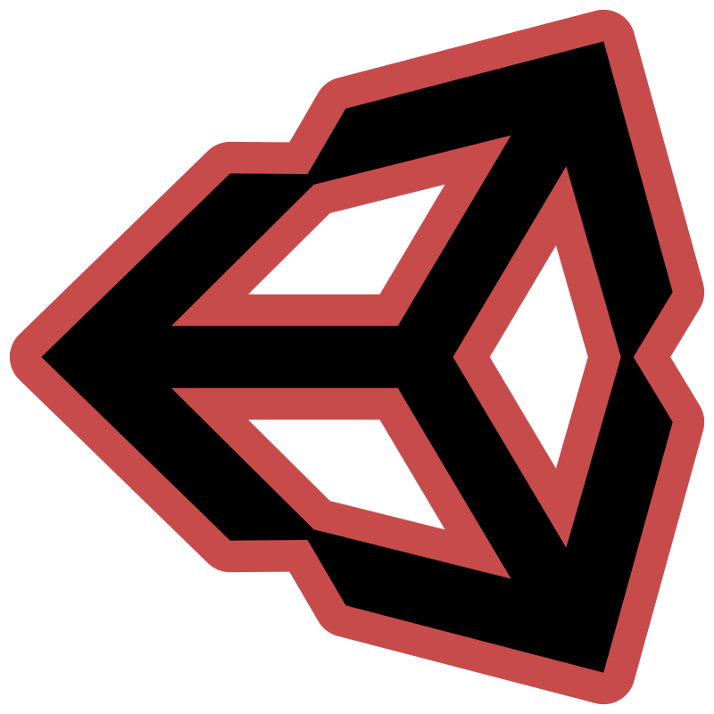
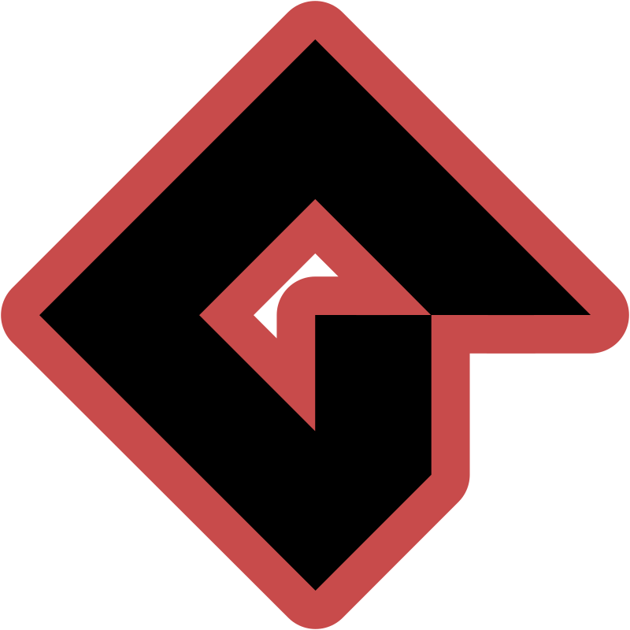
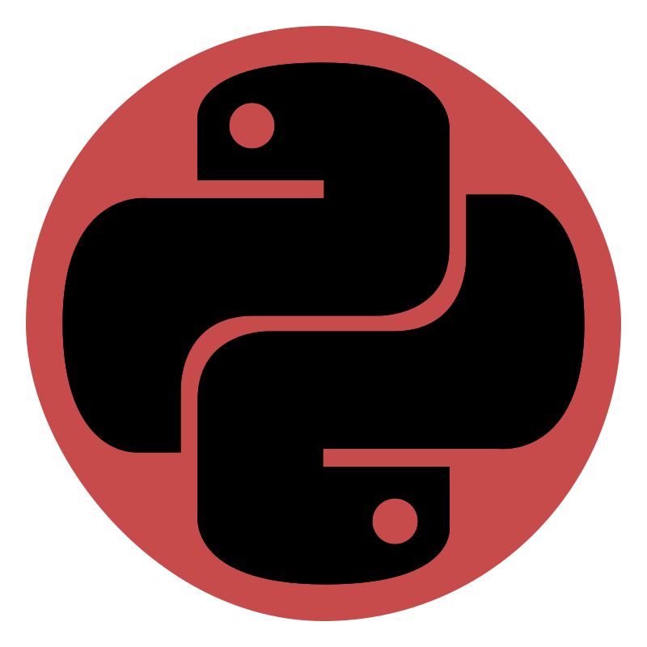
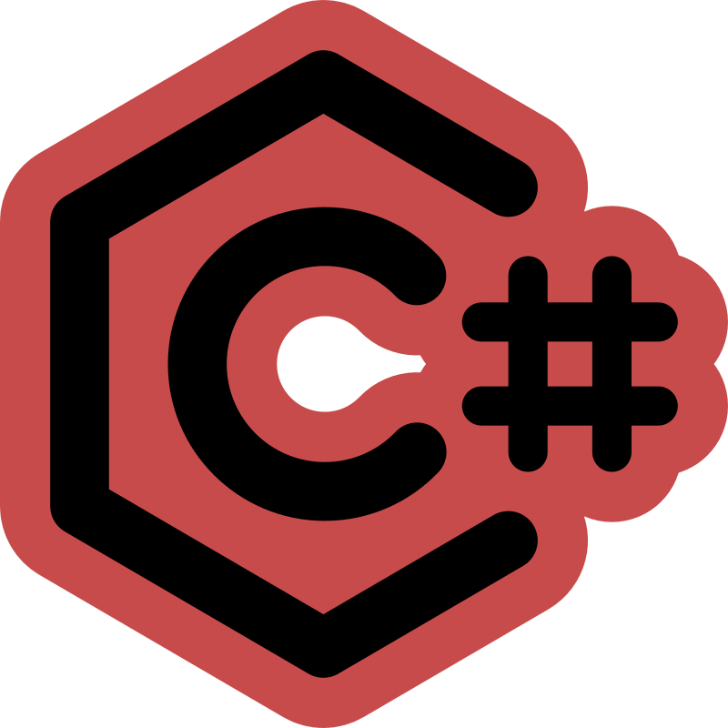

    

        
        
    

<h1> Hello Developers! </h1>

 
Welcome to my GitHub page.

My name is Marco and I'm a video game programmer living in Italy! :star2:

I love to retro gaming and modding games!

<h2> Skills </h2>

    
    
    
    
    
    
    
    
    
    
    
    
    

