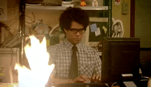
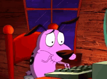

    

        
        
    

<h1> Hello Developers! :octocat: </h1>

 
Welcome to my GitHub page. 

My name is Marco and I'm a video game programmer living in Italy! :star2:

I love to play retro and modding games! :video_game:

<h2> Skills </h2>

    
    
    
    
    
    
    
    
    
    
    
    
    

